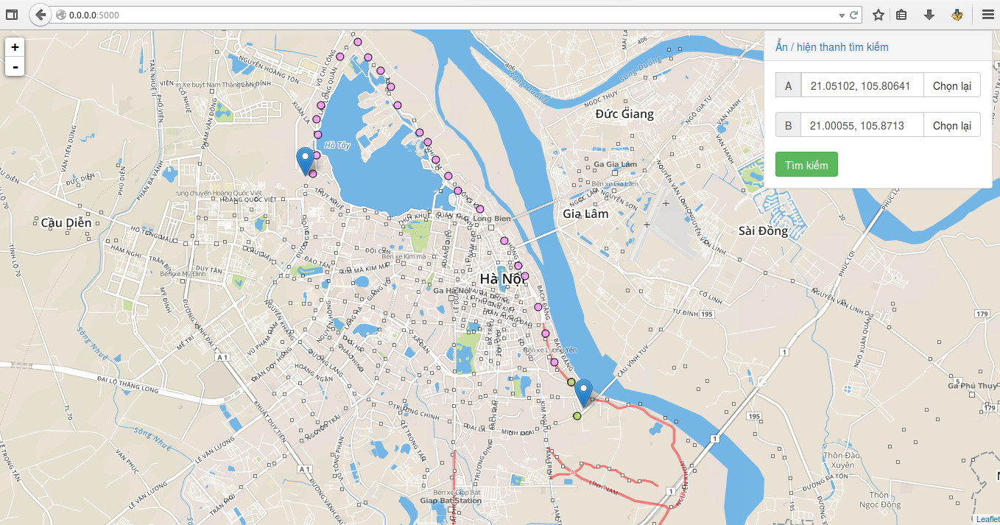

VietBus
-------

## Introduction:

An implementation of A\* algorithm for searching shortest and cheapest bus 
route in Hanoi, Vietnam.

Bus stop data is taken from OpenStreetMap.org, unfortunately, it only 
contains bus stops location (i.e. longitude, latitude) and bus route 
numbers in each stop. There is no bus route for us!

## Problems:

- Clustering bus stops base on number and location to build bus routes
- Apply A\* algorithm to bus stops and bus routes for finding optimal 
routes

## Results:

- Bus routes for all bus are built successful, with some limitations because
of bad data:
    - Not all bus stops are marked in the map
    - Not all bus number are marked in all their stops
    - Data is out of date (most of them are updated in 2010)

- A\* search is implemented successful. Run smoothly (and somewhat slowly)
in our bus stops and bus routes "bad" data.

## Code:

### Extract data

- Extracting bus stops data from OSM file by parsing XML and save to JSON.

- [Source code](app/data/data_extract.py).

### Explore data

- Using matplotlib for exploring data.

- Clustering bus stops to build bus routes by nearest neighbor method and
save results to JSON.

- [Source code](app/data/data_explore.py).

### Import data to MongoDB

- Import results from 2 steps above to MongoDB for querying data.

- [Source code](app/data/data_to_mongo.py).

### Build search models

- Implementing A\* class for graph (bus routes) and node (bus stops). 
[Source code](app/data/models.py).

- Searching from one bus stops to another to find optimal route and return
GeoJSON data. [Source code](app/data/search.py).

### Build web app

- The map is built by using Leaflet library

- Input for start point and end point is taken from user using simple javascript

- Main app take start, stop point infomation, querying MongoDB to find nearest
bus stop, then excuting search using their IDs. GeoJSON output is rendered to
the map.

## How to run the app?

This app is built on top of Python 3.4. May or may not work with Python 2.x

- Download or clone the source code, create virtualenv if necessary
- Install packages using `pip3 install -r requirements.txt`
- Install MongoDB server
- Init database using `python3 manage.py init_db`
- Run web app using `python3 manage.py runserver`
- Go to http://0.0.0.0:5000 for finding bus!

## How does it look?

If all things works, the app may look like this:

